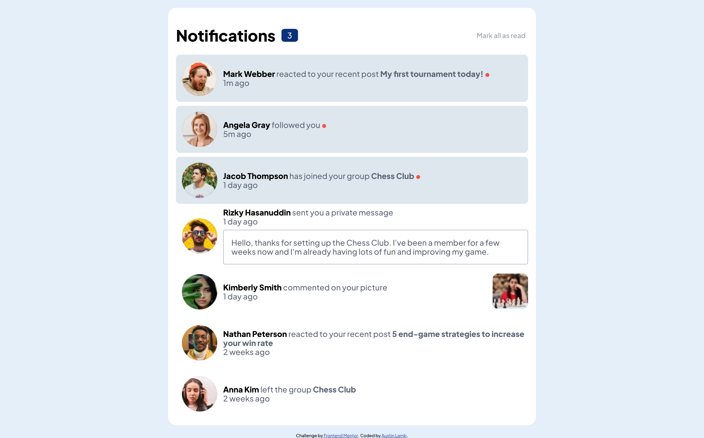

# Frontend Mentor - Notifications page solution

This is a solution to the [Notifications page challenge on Frontend Mentor](https://www.frontendmentor.io/challenges/notifications-page-DqK5QAmKbC). Frontend Mentor challenges help you improve your coding skills by building realistic projects. 

## Table of contents

- [Frontend Mentor - Notifications page solution](#frontend-mentor---notifications-page-solution)
  - [Table of contents](#table-of-contents)
  - [Overview](#overview)
    - [The challenge](#the-challenge)
    - [Screenshot](#screenshot)
    - [Built with](#built-with)
    - [Useful resources](#useful-resources)

## Overview
Notifications page

### The challenge

Users should be able to:

- Distinguish between "unread" and "read" notifications ✅
- Select "Mark all as read" to toggle the visual state of the unread notifications and set the number of unread messages to zero ✅
- View the optimal layout for the interface depending on their device's screen size 
- See hover and focus states for all interactive elements on the page ✅

### Screenshot

### Built with

- JavaScript
- [React](https://reactjs.org/)
- HTML
- [Styled Components](https://styled-components.com/)
- CSS
- Flexbox

### Useful resources

- [Composition vs Inheritance](https://reactjs.org/docs/composition-vs-inheritance.html)
- [Regular Expressions 101](https://regex101.com/)
